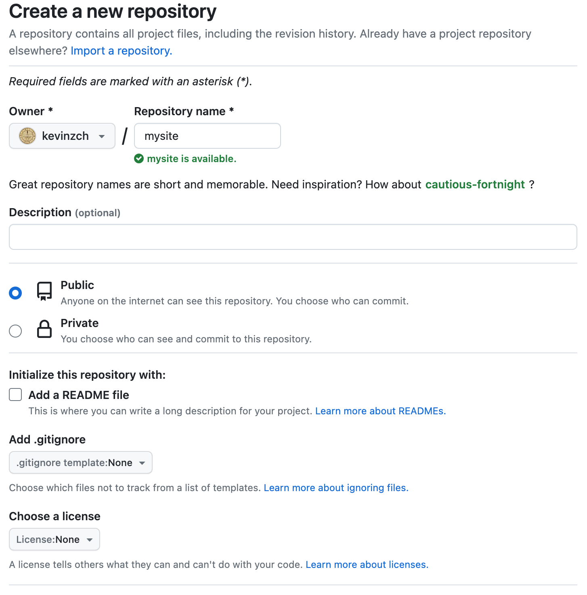
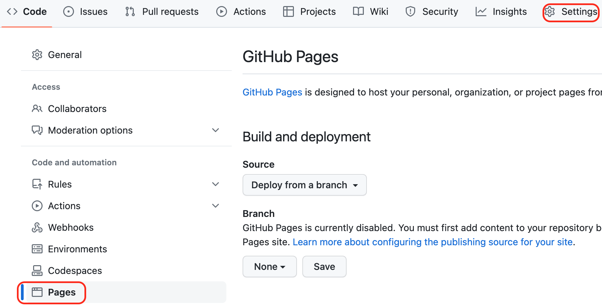
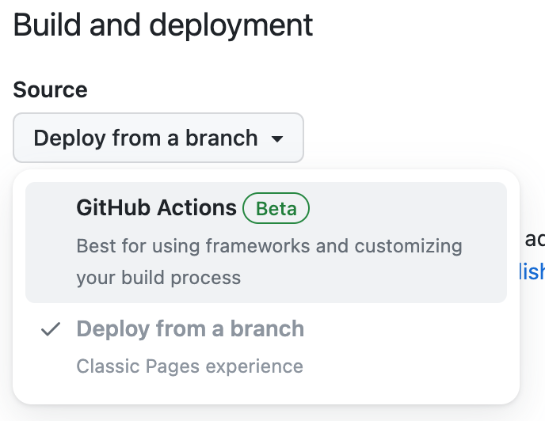
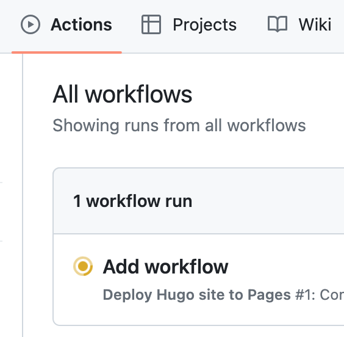
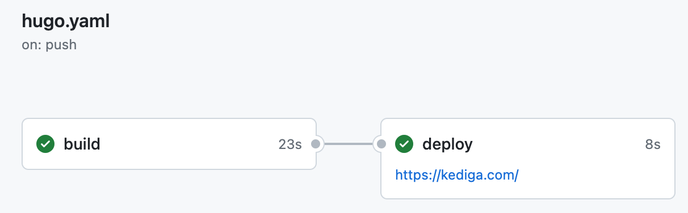

# How to Create a Free Personal Blog Using Hugo and GitHub Pages


## Background

I have had more spare time since I changed my job earlier this year. I have been contemplating ways to share my life and technology experiences while also enhancing my writing skills. Although Wordpress appears to be a quite popular platform for personal blogs, I'd rather not deal with ongoing expenses for servers or disruptions caused by irrelevant technical tasks like virtual machine and database configurations.

That's why using an open source [Static Site Generator](https://en.wikipedia.org/wiki/Static_site_generator) along with a free [web hosting service](https://en.wikipedia.org/wiki/Web_hosting_service) seems like the ideal approach for me.
Here are the tools I used:

* [**Hugo**](https://gohugo.io/): An open source Static Site Generator written in Go that allows you to create fast and flexible websites such as personal blogs, company homepages, galleries and many more.
* [**GitHub Pages**](https://pages.github.com/): A free web hosting service provided by GitHub that allows you to host your site directly from your GitHub repository.

In the end, I built this site to serve as my personal blog by following the documentations of those tools. I decided to document the entire process as a future reference for myself, and for anyone else, like you, who happens to come across this post by chance.

---

## Installation

There are 3 other tools that required to be installed besides Hugo: [Git](https://git-scm.com/), [Go](https://go.dev/) and [Dart Sass](https://sass-lang.com/dart-sass/).
I installed these tools on both my Windows 10 PC and MacBook.

### Windows

#### Install Hugo

I installed Chocolatey first since both Hugo and Sass can also be installed through Chocolatey easily.

##### Install Chocolatey

1. Open PowerShell as administrator and type:

    ```powershell
    Get-ExecutionPolicy
    ```

    If it returns **Restricted**, run the following command:

    ```powershell
    Set-ExecutionPolicy AllSigned
    ```

2. Run the following command to install Chocolatey:

    ```powershell
    Set-ExecutionPolicy Bypass -Scope Process -Force; [System.Net.ServicePointManager]::SecurityProtocol = [System.Net.ServicePointManager]::SecurityProtocol -bor 3072; iex ((New-Object System.Net.WebClient).DownloadString('https://community.chocolatey.org/install.ps1'))
    ```

3. Wait for the command to complete, then confirm Chocolatey has been installed correctly:

    ```powershell
    choco -?
    ```

After installing Chocolatey, install Hugo:

```powershell
choco install hugo-extended
```

#### Install Git

Download the standalone installer from [download page](https://git-scm.com/download/win) and install it.

#### Install Go

Follow this [documentation](https://go.dev/doc/install) to download and install Go.

#### Install Sass

Run following command in PowerShell:

```powershell
choco install sass
```

### macOS

Install [homebrew](https://brew.sh/) whether it is not installed yet.

#### Install Hugo

Open Terminal and run following command:

```bash
brew install hugo
```

#### Install Git

Run following command:

```bash
brew install git
```

#### Install Go

Follow this [documentation](https://go.dev/doc/install) to download and install Go.

#### Install Sass

Run following command:

```bash
brew install sass/sass/sass
```

## Create a site

Run following commands in PowerShell or Terminal.

1. Create the directory structure in the *mysite* directory:

    ```bash
    hugo new site mysite
    ```

2. Change working directory to the root of *mysite*:

    ```bash
    cd mysite
    ```

3. Create an empty Git repository in the working directory:

    ```bash
    git init
    ```

4. Clone the [Stack](https://github.com/CaiJimmy/hugo-theme-stack) theme to the theme directory, adding it to *mysite* as a Git submodule:

    ```bash
    git submodule add https://github.com/CaiJimmy/hugo-theme-stack/ themes/hugo-theme-stack
    ```

5. Apply theme:

    ```bash
    echo "theme = 'hugo-theme-stack'" >> hugo.toml
    ```

6. Now start Hugo’s development server and open the URL displayed in terminal to have a look at the site we created.

    ```bash
    hugo server
    ```

Development server can be stopped by pressing **Ctrl** + **C**.

## Add a post

1. Add a new post to *mysite*:

    ```bash
    hugo new content posts/my-first-post.md
    ```

2. A markdown file was created in content/posts directory by Hugo. Open the file:

    ```markdown
    ---
    title: "My First Post"
    date: 2023-07-19T17:51:29+09:00
    draft: true
    ---
    ```

3. Add some content to the body of the post and save the file.

    ```markdown
    ---
    title: "My First Post"
    date: 2023-07-19T17:51:29+09:00
    draft: true
    ---

    ## Introduction

    Hello!
    This is my first post.
    ```

4. Start Hugo’s development server again and have a look at the post:

    ```bash
    hugo server -D
    ```

## Host on GitHub Pages

1. A GitHub account is required for hosting site on GitHub Pages. [Sign up an account](https://github.com/signup?source=login) if you don't already have one.

2. [Create a new repository](https://github.com/new). Usually, a Pro(paid) account is needed to host site from private repository. Create a public repository if you want to host your site free.[^1]

    

3. Push local repository of *mysite* to GitHub:

    ```bash
    git remote add origin git@github.com:$GitHubUserName/$RepositoryName.git
    git branch -M main
    git push -u origin main
    ```

4. Open GitHub repository page. Click on Settings > Pages.

    

5. Change the Source to **GitHub Actions**.

    

6. Create an empty file in local repository.

    `.github/workflows/hugo.yaml`

7. Copy and paste the following YAML into the file created in step6. Change the branch name and Hugo version.(If you used the command in step3, the branch name should be *main*. And Hugo version can be confirmed by running `hugo version` in Terminal. It is better to use the same version in both local and remote repository.)

    ```bash
    # Sample workflow for building and deploying a Hugo site to GitHub Pages
    name: Deploy Hugo site to Pages

    on:
    # Runs on pushes targeting the default branch
    push:
        branches:
        - main

    # Allows you to run this workflow manually from the Actions tab
    workflow_dispatch:

    # Sets permissions of the GITHUB_TOKEN to allow deployment to GitHub Pages
    permissions:
    contents: read
    pages: write
    id-token: write

    # Allow only one concurrent deployment, skipping runs queued between the run in-progress and latest queued.
    # However, do NOT cancel in-progress runs as we want to allow these production deployments to complete.
    concurrency:
    group: "pages"
    cancel-in-progress: false

    # Default to bash
    defaults:
    run:
        shell: bash

    jobs:
    # Build job
    build:
        runs-on: ubuntu-latest
        env:
        HUGO_VERSION: 0.115.3
        steps:
        - name: Install Hugo CLI
            run: |
            wget -O ${{ runner.temp }}/hugo.deb https://github.com/gohugoio/hugo/releases/download/v${HUGO_VERSION}/hugo_extended_${HUGO_VERSION}_linux-amd64.deb \
            && sudo dpkg -i ${{ runner.temp }}/hugo.deb          
        - name: Install Dart Sass
            run: sudo snap install dart-sass
        - name: Checkout
            uses: actions/checkout@v3
            with:
            submodules: recursive
            fetch-depth: 0
        - name: Setup Pages
            id: pages
            uses: actions/configure-pages@v3
        - name: Install Node.js dependencies
            run: "[[ -f package-lock.json || -f npm-shrinkwrap.json ]] && npm ci || true"
        - name: Build with Hugo
            env:
            # For maximum backward compatibility with Hugo modules
            HUGO_ENVIRONMENT: production
            HUGO_ENV: production
            run: |
            hugo \
                --gc \
                --minify \
                --baseURL "${{ steps.pages.outputs.base_url }}/"          
        - name: Upload artifact
            uses: actions/upload-pages-artifact@v1
            with:
            path: ./public

    # Deployment job
    deploy:
        environment:
        name: github-pages
        url: ${{ steps.deployment.outputs.page_url }}
        runs-on: ubuntu-latest
        needs: build
        steps:
        - name: Deploy to GitHub Pages
            id: deployment
            uses: actions/deploy-pages@v2
    ```

8. Commit the change to local repository and push to GitHub.

9. Click on Actions from GitHub repository. The orange circle indicates the workflow is running now:

    

10. After the workflow finished, the indicator will change to a green check.

    

11. Click on the workflow. the url to *mysite* will be shown:

    

12. Click on the url to access *mysite* that is being hosted by GitHub Pages now. Normally, the URL should be in the format `https://$GitHubUsername.github.io/$RepositoryName1`. However, I have been using a custom domain which is why my URL is different. From now on, whenever a change is made to this GitHub repository, GitHub will rebuild *mysite* and deploy the changes.

*If you have any questions or advice, leave me a comment below and I will try my best to respond!*

[^1]: This an indirect way of [hosting Hugo site from private repository](https://kediga.com/posts/host-hugo-site-from-private-repository/).

