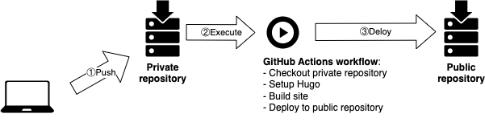

# How to host Hugo site from private repository


## Background

Usually, in order to utilize GitHub Pages for free hosting my Hugo site, I have to make the repository public. However, this also implies that even my draft posts will become visible in the public site repository. That is definitely not the way I prefer to do this.

## Solution

After some searching, I found out that I can hide my draft posts and publish only the static site to the public repository by using GitHub Actions:



### Prerequisites

* A private repository(Just turn the present public repository of Hugo site into private repository)
* A newly created public repository to publish Hugo site
* GitHub Personal token

#### Create a GitHub personal token

1. Click on your GitHub avatar in top-right and open `Settings` page.

    

2. Click on `Developer settings`(at the bottom of the page).

    

3. Click on `Personal access tokens` -> `Tokens(classic)` -> `Generate new token` -> `Generate new token(classic)`.

    

    
Personal token is required because we need the permission to access to a external repository.
    

4. Add a note for token. Select expiration.

5. Select scopes:
    * :white_check_mark: workflow
    * :white_check_mark: write:packages

    

6. Click on `Generate toke`.

7. Copy the token start with `ghp_`

#### Add GitHub personal token to private repository

1. Open the `Settings` of private repository.

2. Click on `Secrets and variables` -> `Actions`

    

3. Click on `New repository secret`

4. Add name then paste the token to the `Secret` area.

    

5. Click on `Add secret`

### GitHug workflow configurations

Here is the workflow configuration file I made for my Hugo site:

```yaml
# Workflow for building and deploying a Hugo site to GitHub Pages
name: Build & Deploy Hugo site From private repository to public repository

on:
  push:
    branches:
      - main  # Set a branch to deploy
  pull_request:

jobs:
  deploy:
    runs-on: ubuntu-22.04
    permissions:
      contents: write
    concurrency:
      group: ${{ github.workflow }}-${{ github.ref }}
    steps:
      - uses: actions/checkout@v3
        with:
          submodules: true  # Fetch Hugo themes (true OR recursive)
          fetch-depth: 0    # Fetch all history for .GitInfo and .Lastmod

      - name: Setup Hugo
        uses: peaceiris/actions-hugo@v2
        with:
          hugo-version: '0.115.3'  # Hugo version I'm using. Or use latest version by set value to 'latest'.
          extended: true

      - name: Build
        run: hugo --minify  # Minify build result

      - name: Deploy to public repository
        uses: peaceiris/actions-gh-pages@v3
        if: github.ref == 'refs/heads/main'
        with:
          personal_token: ${{ secrets.PERSONAL_TOKEN }}
          external_repository: kevinzch/KEDIGA_Public  # Public repository to deploy
          publish_branch: main
          publish_dir: ./public
          cname: kediga.com  # Domain of site
```

Replace the configuration file under `.github/workflows` with it. Then push the changes to private repository and check whether the workflow runs successfully.

## Conclusion

This way, I can push all the content, including draft posts, drawio files, and other files related to my site, to my private repository without worrying about they being made public.

## References

* [Using GitHub Actions to Publish Hugo Site From Private to Public Repo](https://blog.euc-rt.me/post/github-actions-publish-private-hugo-repo-to-public-pages-site/).

* [Deploy Hugo From Private Repository to GitHub Pages](https://finisky.github.io/deployhugofromprivaterepo.en/)

* [actions-gh-pages](https://github.com/peaceiris/actions-gh-pages)

* [GitHub Actions documentation](https://docs.github.com/en/actions)

*If you have any questions or advice, leave me a comment below and I will try my best to respond!*

